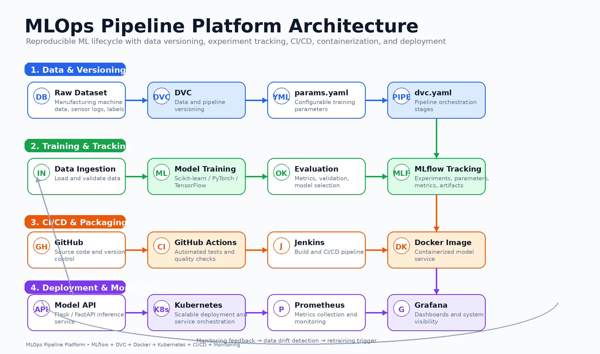

# 🚀 MLOps & AI Portfolio

Production-grade ML systems focused on real-world deployment, automation, and scalability.

⭐ Building production-ready AI systems | Open to ML / MLOps roles  

💼 Focused on building scalable AI systems for real-world production environments.

---


<!-- ---
## 📸 Demo
with 1–2 images per project
 -->

---

## 💡 Highlights

- Designed and deployed scalable ML pipelines using **CI/CD, Docker, and Kubernetes**
- Developed LLM systems using **RAG and multi-agent architectures**
- Deployed production systems on **AWS & GCP**
- Implemented monitoring with **Prometheus & Grafana**
- Designed **end-to-end ML lifecycle systems** (data → training → deployment)

---

## 🛠️ Key Skills Demonstrated

- **MLOps:** CI/CD, Docker, Kubernetes, MLflow, DVC
- **Machine Learning:** End-to-end pipelines, model training, evaluation
- **LLM Systems:** RAG, Agents, LangChain, Vector Databases
- **Cloud:** AWS, GCP
- **Monitoring:** Prometheus, Grafana
- **Backend & APIs:** Flask, FastAPI

---

## 📂 Featured Projects

### ⚙️ MLOps & Production Pipelines

- [MLOps Pipeline Platform](https://github.com/hossain-sanowar/mlops-pipeline-platform)  
  Reproducible ML pipeline with MLflow, DVC, Docker, Kubernetes, CI/CD, and monitoring (PyTorch, TensorFlow, AWS, GCP)

- [NLP Sentiment MLOps Pipeline](https://github.com/hossain-sanowar/nlp-sentiment-mlops-pipeline)  
  Production NLP system with automated pipelines, CI/CD (GitHub Actions, Jenkins), and monitoring stack

---

### 🏭 Machine Learning Systems

- [Consignment Product Prediction](https://github.com/hossain-sanowar/Consignment-Product-Prediction)  
  End-to-end ML system with ETL pipelines, Airflow, DVC, Docker, AWS (S3, EC2), Hadoop, TensorFlow, and web UI

- [Kidney Disease Classification](https://github.com/hossain-sanowar/end-end-Kidney_Disease_Classification)  
  ML pipeline with DVC, CI/CD on AWS, and user-facing application for healthcare prediction

---

### 🤖 LLM & Generative AI Systems

- [Flipkart LLM Production System](https://github.com/hossain-sanowar/llm_flipkart_production)  
  RAG-based LLM system using Groq, HuggingFace, LangChain, AstraDB with Docker, Kubernetes, and monitoring

- [AI Study Agent](https://github.com/hossain-sanowar/llm_aiStudy_agent)  
  Multi-agent LLM system with LangChain, Groq, Kubernetes, Jenkins, WebHooks, and scalable API deployment

- [AI Music Composer](https://github.com/hossain-sanowar/llm_AImusic_composer)  
  AI-powered music generation using Music21, Groq, LangChain with Docker, Kubernetes (GKE), and cloud deployment

---

## 📘 Machine Learning Foundations

- [Machine Learning Projects](https://github.com/hossain-sanowar/Machine-Learning-Projects)  
  Collection of core ML algorithms including regression, classification, clustering, and ensemble methods  
  *(Linear Regression, SVM, KNN, Random Forest, XGBoost)*  
  *Represents foundational work and early exploration in machine learning.*

---

## 🏗️ Architecture

This architecture represents an end-to-end MLOps pipeline integrating data versioning, experiment tracking, CI/CD automation, and containerized deployment.



---

## 📁 Project Structure
```text
mlops-pipeline-platform/
├── README.md
├── requirements.txt
├── Dockerfile
├── .gitignore
├── src/
│   ├── data_ingestion.py
│   ├── train.py
│   ├── evaluate.py
│   ├── predict.py
│   └── config.py
├── notebooks/
│   └── experiments.ipynb
├── dvc.yaml
├── params.yaml
├── mlruns/
├── tests/
│   └── test_pipeline.py
├── .github/
│   └── workflows/
│       └── ci.yml
└── jenkins/
    └── Jenkinsfile
```
## 🧱 Core Project: MLOps Pipeline Platform

A reproducible end-to-end MLOps pipeline with experiment tracking, data versioning, CI/CD automation, and containerized deployment.

## 📖 Overview

This project demonstrates a production-style MLOps workflow for training, evaluating, versioning, and deploying machine learning models using modern infrastructure and automation tooling.

## ⚡ Features
- Experiment tracking with MLflow
- Data and pipeline versioning with DVC
- Automated CI/CD workflows
- Dockerized model packaging
- Kubernetes-ready deployment
- Modular training and evaluation pipeline

## 🧰 Tech Stack
- Python
- MLflow
- DVC
- Docker
- Kubernetes
- Jenkins
- GitHub Actions

## 📂 Code Structure
- `src/` modular pipeline steps
- `dvc.yaml` pipeline orchestration
- `params.yaml` configurable parameters
- `.github/workflows/` CI workflow
- `jenkins/` Jenkins pipeline config

## Run Locally
```bash
git clone https://github.com/hossain-sanowar/mlops-pipeline-platform
cd mlops-pipeline-platform
pip install -e .
python src/train.py
```
---
## 🔄 Pipeline

- Data Ingestion  
- Data Preprocessing  
- Model Training  
- Model Evaluation  
- Experiment Tracking (MLflow)  
- Packaging & Deployment  

Designed as a reference implementation for reproducible and production-grade ML workflows.

---
## 📊 Impact

- Reduced manual ML workflow effort by ~80% through automation
- Enabled reproducible experiments using MLflow & DVC
- Designed scalable deployments using Docker & Kubernetes


---

## 🎯 Use Case

This project demonstrates how to design, build, and deploy scalable ML systems using modern MLOps practices, making it suitable for real-world production environments.

---

## 👨‍💻 Author

**Md Sanowar Hossain**  
Machine Learning Engineer | MLOps | Applied AI  

